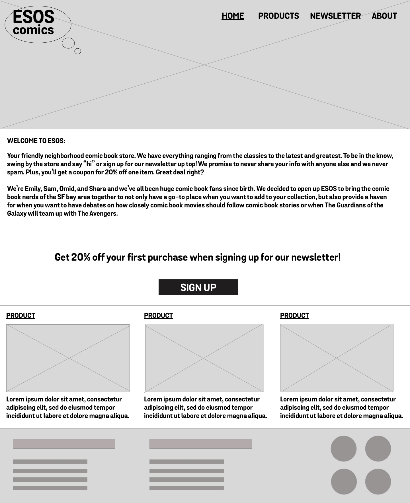

# ESOS Comics

Website for fictional comic book store. A 24-hour, collaborative project between General Assembly's User Experience Design and Web Development Immersive classes.

## Goal

Create a way for users to sign up to receive your client’s newsletter via email.

## Team

- UX Design: Omid Moayedi, Sam Koch, Shara Shimabukuro
- Web Development: Emily Lane

## User stories

Summary of user stories provided to each team:

1. As a user, I am interested in signing up to receive email newsletter(s) from the client, and want to
   know more information about their newsletter(s).
2. As a user, I want to feel like I am getting something of value in exchange for my personal
   information
3. As the business, I want the form to be integrated with MailChimp

## Wireframes

- Note: additional annotated wireframes provided not shown.

## Technology

- HTML
- CSS
- JavaScript
- JQuery
- MailChimp
